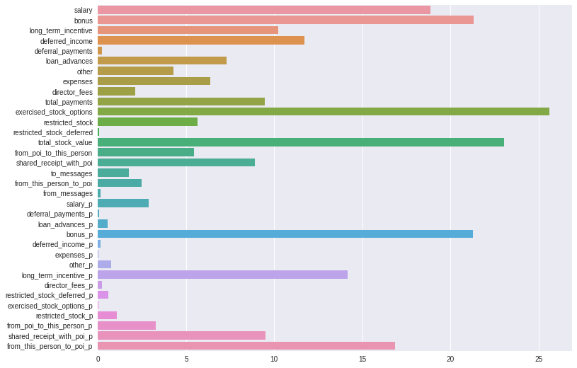
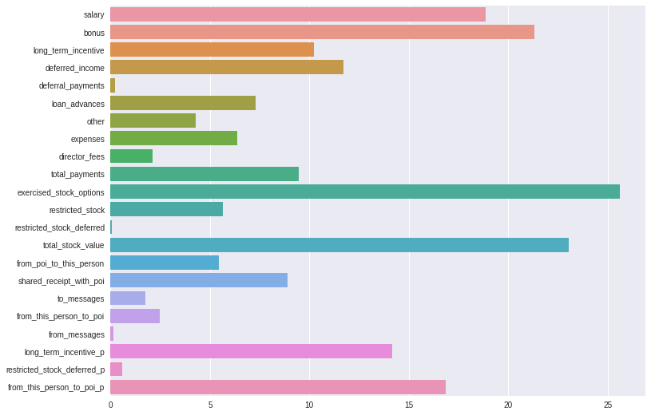
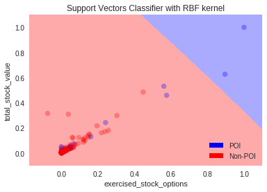

# Identify Fraud Using Machine Learning (Project Overview)

## Goal of the project

In 2000, Enron was one of the largest companies in the United States. By 2002, it had collapsed into bankruptcy due to widespread corporate fraud. In the resulting Federal investigation, a significant amount of typically confidential information entered into the public record, including tens of thousands of emails and detailed financial data for top executives.
These data have been combined with a hand-generated list of persons of interest in the fraud case, which means individuals who were indicted, reached a settlement or plea deal with the government, or testified in exchange for prosecution immunity. These data have created a dataset of 21 features for 146 employees.

The scope of the project is the creation of an algorithm with the ability to identify Enron Employees who may have committed fraud. To achieve this goal, Exploratory Data Analysis and Machine Learning were deployed to clear the dataset from outliers, identify new parameters and classify the employees as potential Persons of Interest.

## Data Exploration

The features included in the dataset can be divided in three categories, Salary Features, Stock Features and Email Features. Bellow you may find the full feature list with  brief definition of each one.

**Salary Features**

| Payments            | Definitions of Category Groupings                                                                                                                                                                                                                                                                                                                                                                                                |
|---------------------|----------------------------------------------------------------------------------------------------------------------------------------------------------------------------------------------------------------------------------------------------------------------------------------------------------------------------------------------------------------------------------------------------------------------------------|
| ***Salary***              | Reflects items such as base salary, executive cash allowances, and benefits payments.                                                                                                                                                                                                                                                                                                                                            |
| ***Bonus***               | Reflects annual cash incentives paid based upon company performance. Also may include other retention payments.                                                                                                                                                                                                                                                                                                                  |
| ***Long Term Incentive*** | Reflects long-term incentive cash payments from various long-term incentive programs designed to tie executive compensation to long-term success as measuredagainst key performance drivers and business objectives over a multi-year period, generally 3 to 5 years.                                                                                                                                                            |
| ***Deferred Income***     | Reflects voluntary executive deferrals of salary, annual cash incentives, and long-term cash incentives as well as cash fees deferred by non-employee directorsunder a deferred compensation arrangement. May also reflect deferrals under a stock option or phantom stock unit in lieu of cash arrangement.                                                                                                                     |
| ***Deferral Payments***   | Reflects distributions from a deferred compensation arrangement due to termination of employment or due to in-service withdrawals as per plan provisions.                                                                                                                                                                                                                                                                        |
| ***Loan Advances***       | Reflects total amount of loan advances, excluding repayments, provided by the Debtor in return for a promise of repayment. In certain instances, the terms of thepromissory notes allow for the option to repay with stock of the company.                                                                                                                                                                                       |
| ***Other***               | Reflects items such as payments for severence, consulting services, relocation costs, tax advances and allowances for employees on international assignment (i.e.housing allowances, cost of living allowances, payments under Enron’s Tax Equalization Program, etc.). May also include payments provided with respect toemployment agreements, as well as imputed income amounts for such things as use of corporate aircraft. |
| ***Expenses***            | Reflects reimbursements of business expenses. May include fees paid for consulting services.                                                                                                                                                                                                                                                                                                                                     |
| ***Director Fees***       | Reflects cash payments and/or value of stock grants made in lieu of cash payments to non-employee directors.                                                                                                                                                                                                                                                                                                                     |
| ***Total Payments***      | Sum of the above values                                                                                                                                                                                                                                                                                                                                                                                                         |
***

**Stock Features**

| Stock Value              | Definitions of Category Groupings                                                                                                                                                                                                                                                                                                                                                       |
|--------------------------|-----------------------------------------------------------------------------------------------------------------------------------------------------------------------------------------------------------------------------------------------------------------------------------------------------------------------------------------------------------------------------------------|
| ***Exercised Stock Options***  | Reflects amounts from exercised stock options which equal the market value in excess of the exercise price on the date the options were exercised either throughcashless (same-day sale), stock swap or cash exercises. The reflected gain may differ from that realized by the insider due to fluctuations in the market price andthe timing of any subsequent sale of the securities. |
| ***Restricted Stock***         | Reflects the gross fair market value of shares and accrued dividends (and/or phantom units and dividend equivalents) on the date of release due to lapse of vestingperiods, regardless of whether deferred.                                                                                                                                                                             |
| ***Restricted StockDeferred*** | Reflects value of restricted stock voluntarily deferred prior to release under a deferred compensation arrangement.                                                                                                                                                                                                                                                                     |
| ***Total Stock Value***        | Sum of the above values                                                                                                                                                                                                                                                                                                                                                                 |
***

**email features**

| Variable                      | Definition                                                                    |
|-------------------------------|-------------------------------------------------------------------------------|
| ***to messages***             | Total number of emails received (person's inbox)                              |
| ***email address***           | Email address of the person                                                   |
| ***from poi to this person*** | Number of emails received by POIs                                             |
| ***from messages***           | Total number of emails sent by this person                                    |
| ***from this person to poi*** | Number of emails sent by this person to a POI.                                |
| ***shared receipt with poi*** | Number of emails addressed by someone else to a POI where this person was CC. |

During the process some outliers were revealed probably due to data extraction from the [Payments Schedule](dataset/enron61702insiderpay.pdf). In one occasion there was a datapoint named 'TOTAL' matching the totals row from the Schedule and also, two datapoints with transposed values across features. The first datapoint removed from the dataset and the other two corrected.

## Feature Selection/Engineering

There are some cases where the value of a variable might be less important than its proportion to a related aggregated value. As an example from the current dataset, a bonus of 100,000 is less informative than a bonus 3 times the salary, or "500 sent email to POIs" is far less informative than "half of the sent emails have been sent to POIs".
For this reason and since all the features were related to an aggregated value, I created the proportions of all the features to their respective aggregated value. These new features added to the dataset and the 'enchanced' dataset evaluated with the ```SelectPercentile(percentile=100)```.  
  
The result showed that the proportions of "*Long Term Incentive*", "*Restricted Stock Deferred*" and "*From This Person to POI*" were more significant than the related original feature.  They added to the dataset and in the same time removed the original features to avoid any bias towards these features.

The used classifier is not based on recursive partitioning, so scaling was required. Since the dataset was quite sparse, ```MaxAbsScaler()``` was selected to preserve the sparseness structure in the data. The final features and their importance after the above procedure were:  


Afterword, I evaluated several classifiers both with Univariate Feature Selection and Primary Component Analysis and I ended up with PCA with 2 principal components.

## Algorithm Selection

The most appropriate algorithm for the specific case was **Nearest Centroid**. Bellow you may find all the evaluated algorithms and their performance.

|           Category           |        Algorithm       |   Accuracy  |  Precision  |    Recall   |      F1     |      F2     |
|:----------------------------:|:----------------------:|:-----------:|:-----------:|:-----------:|:-----------:|:-----------:|
|    Support Vector Machine    |        LinearSVC       |   0.76007   |   0.24481   |   0.38350   |   0.29885   |   0.34447   |
|    Support Vector Machine    |           SVC          | **0.86927** | **0.88235** |   0.02250   |   0.04388   |   0.02795   |
| Nearest Neighbors            | KNeighborsClassifier   | 0.85193     | 0.43233     | 0.35300     | 0.38866     | 0.36645     |
| **Nearest Neighbors**        | **NearestCentroid**    | 0.73833     | 0.30975     | **0.78350** | **0.44397** | **0.59997** |
| Ensemble Methods (Averaging) | RandomForestClassifier | 0.83293     | 0.36427     | 0.33950     | 0.35145     | 0.34418     |
| Ensemble Methods (Boosting)  | AdaBoostClassifier     | 0.84893     | 0.40404     | 0.28000     | 0.33077     | 0.29832     |


As can be seen in the table, Support Vector Classifier performed better in Accuracy and Precision and Nearest Centroid in Recall and the F scores. I ended up using Nearest Centroid because I wanted a more balanced behavior, otherwise a high score may be misleading if it is combined with poor score in the other categories. This can be demonstrated graphically.  

|SVC                    |Nearest Centroid                                 |
|:---------------------:|:-----------------------------------------------:|
|||

It is clear that the extremely high (comparing to the rest) Precision of SVC is because it evaluates very "conservative" the datapoints. It makes two right picks but it can only spot 2 out of 18 POIs.  
On the other hand, Nearest Centroid has some false positives but in general can better distinct POIs from non-POIs.

## Hyperparameters Optimization

For parameter optimization I used Exhaustive Grid Search to conclude to the following parameters:

|      Process      |    Algorithm    |     Parameter    |      Evaluated Values      |  Selected Value  |
|:-----------------:|:---------------:|:----------------:|:--------------------------:|:----------------:|
|      Scaling      |  MaxAbsScaller  |       copy       |      True      | True |
| Feature Selection |       PCA       |   n_components   |        [2, 3, 4, 5]        |         2        |
|   Classification  | NearestCentroid |      metric      | ["euclidean", "manhattan"] |    "manhattan"   |
|                   |                 | shrink_threshold |     [None, 0.1, 1, 10]     |       None       |
***
(*Note: Additional Scaling and Feature Selection methods were evaluated, but they didn't performed as well as the above.*)
